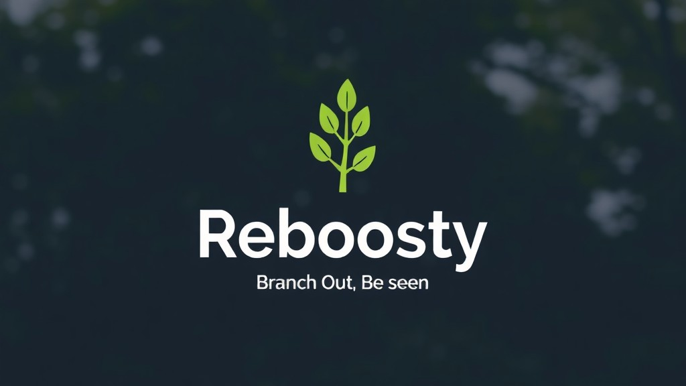

# Reboosty
**Reboosty: Branch Out. Be Seen.**



---

Reboosty is a **peer-promotion network** for **open-source** developers. By adding the badge to your `README.md`, you are joining the **Reboosty network** who are committed to promoting each other's projects. The more you promote, the more you get promoted!

## 🔍 How it works
1. **Join the Reboosty Network:** When you add the **Reboosty badge** to your README, your repository joins the **network**.
2. **Automatic Promotion Cycle:**
   - Each time someone views your badge, it randomly selects a project from the **Reboosty network** to promote (cached for 1 hour).
   - Your project is promoted in someone else's `README.md`, increasing its visibility.
   - The more you promote, the more you get promoted!
3. **Human Visitors Impact:** When someone clicks the badge, they're **redirected** to the **featured project**.
4. **Fair Distribution:** The badge ensures that every project in the **Reboosty network** gets a **fair** chance to be promoted, with a **caching mechanism** to balance **exposure** and **loading speed**.

## Demo
<a href="https://reboosty-reboosty.vercel.app/api?repo_url=https://github.com/reboosty/reboosty" target="_blank">
  
</a>

It will show a random project from the **Reboosty network**. Click on the badge to see the **featured project**.

## 🎨 Usage
Joining the **Reboosty network** is simple! Just add the following badge to your repository's `README.md` file:

```markdown
<a href="https://reboosty-reboosty.vercel.app/api?repo_url=https://github.com/{your-username}/{your-repo}" target="_blank">
  
</a>
```

1) Replace `{your-username}` and `{your-repo}` with your GitHub username and repository name, respectively. (e.g. `repo_url=https://github.com/moe-mizrak/laravel-openrouter`)
2) Commit the change to your `README.md` and push it.
3) **That’s it—effortless and powerful!** In just seconds, your badge will **promote** a randomly selected **open-source project** from the **Reboosty network**, and in return, **your repo** gets **promoted** in someone else’s `README.md`.

> [!NOTE]
> Smart caching for fair exposure.
> 
> Each badge displays a randomly selected project from the **Reboosty network**, cached for 1 hour to ensure fast loading and balanced visibility — so every project gets its moment to shine.

---
## 💫 Contributing

> **Your contributions are welcome!** If you'd like to improve this project, simply create a pull request with your changes. Your efforts help enhance its functionality and documentation.

> If you find this project useful, please consider ⭐ it to show your support!

## 📜 License
Reboosty is an open-sourced software licensed under the **[MIT license](LICENSE)**.
